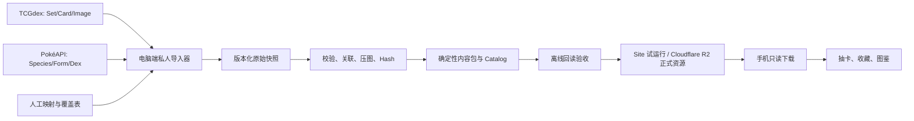

# 第二大阶段计划：全量卡牌资料库与宝可梦图鉴

最后更新：2026-07-30

状态：进行中（Phase 2A–2D 已完成）

完成度：45%

前置条件：已满足。第一大阶段的最终 ARM64 构建、静态验收与 100% 完成度审计已于 2026-07-30 通过。

## 一、这一阶段要完成什么

第二大阶段包含两条互相连接、但可以分别测试的主线：

1. 建立可以发现、下载、校验、打包、上传及更新全部卡牌资料的内容生产线。
2. 建立按宝可梦世代与全国图鉴编号浏览的图鉴，并把每只宝可梦及其形态连接到所有相关卡牌。

这不是把宝可梦逻辑写死进通用抽卡核心。通用抽卡、收藏、远程内容和存档系统继续保持通用；宝可梦的世代、物种、形态和卡牌关联放在独立的 Pokémon Taxonomy/Presentation 模块中。

## 二、需求解释与统一规则

### 2.1 “卡包”先拆成两个概念

- `Set`：扩充包/系列，例如 Base Set、Neo Genesis。它负责卡表、发布日期、系列与排序。
- `Product`：实际可开启的产品，例如某个卡包包装、礼盒或补充包。它负责抽卡规则与包装图片。

第二大阶段首先完成全部 `Set` 的资料与排序。真实 `Product` 可以引用一个或多个 Set，但不能再默认“一个 Set 永远只有一个卡包产品”。

### 2.2 卡包/系列排序

每个 Set 必须保存稳定字段，不能从显示名称临时猜测：

- `generationId`：归属世代。
- `eraId/seriesId`：所属时代或系列。
- `setId`：资料源稳定 ID。
- `setCode`：官方或资料源编号。
- `setOrdinal`：同一时代内的人工确认顺序。
- `releaseDate`：发布日期。
- `localizedNames`：多语言名称。

默认浏览顺序为：

```text
世代顺序 → 发布日期 → 时代内编号 → Set 编号 → Set 名称 → 稳定 ID
```

界面同时提供“按世代”“按时间”“按编号”“按名称”四种排序模式；所有模式都使用稳定 ID 作为最后的平手规则，确保不同设备得到相同顺序。

TCGdex 的 `serie` 不能直接等同宝可梦游戏世代，因此另设一份可版本控制的 `set-generation-overrides.json`。系统先采用自动规则，再以人工覆盖表作为最终结果。

### 2.3 图鉴中的物种与形态

- 主图鉴以 `speciesId / nationalDexNumber` 为身份，不以显示名称为身份。
- 每个物种只在首次登场世代的主图鉴出现一次。例如第一世代固定按 #001–#151 排列。
- 第二、第三及之后世代继续按首次登场世代分组，再按全国图鉴编号排列。
- 同一只宝可梦在后续时代出现，不会产生另一份物种记录。
- 阿罗拉、伽勒尔、洗翠、帕底亚等地区形态是独立 `form`，但与原始物种共用同一个 `speciesId`。
- 地区形态不占新的全国图鉴编号。图鉴可在其首次出现世代提供“新形态”分区，例如 `#019-A`，同时在 #019 物种详情中双向跳转。
- Mega、Gigantamax、战斗限定、性别差异、颜色/装饰差异不能全部视为同一种形态；必须先经过“形态分类政策”决定是否成为独立图鉴页。

### 2.4 “同名卡片”的精确定义

不能只比较 `card.name`，因为同一物种可能有 `ex`、`GX`、所属训练家、地区形态或多宝可梦卡牌。采用多对多关联：

- 每张 Pokémon 卡至少关联一个 `speciesId`。
- 能确定形态时再关联 `formId`。
- 无法确定具体形态时保留物种级关联，不能猜测为默认形态。
- Trainer、Energy 等非宝可梦卡明确标为 `not-applicable`，不能算作漏配。
- 多宝可梦卡牌允许关联多个物种。

图鉴详情页的卡牌区提供两个范围：

1. 当前形态：只显示已确认属于当前形态的卡。
2. 全部同种宝可梦：显示该 `speciesId` 下的所有形态与尚未细分形态的卡。

这样既能把阿罗拉形态独立记录，又不会失去“查看这只宝可梦的所有卡牌”的能力。

## 三、资料来源与责任边界

### 3.1 卡牌资料

首选 TCGdex：

- 通过 Sets 列表端点发现全部 Set，不再维护写死的 Set ID 清单。
- 保存 Set、Card 与图片来源快照、抓取时间、资料源版本及 SHA-256。
- 使用详细 Set 资料中的发布日期、系列、boosters 等字段，但世代与同代顺序由本项目映射层确认。

### 3.2 图鉴资料

首选 PokéAPI：

- `pokemon-species` 提供稳定物种 ID、首次登场世代、多语言名称、简介与 varieties。
- `pokemon` 表示物种下的具体变体。
- `pokemon-form` 提供视觉形态、默认/战斗限定/Mega 等标记与图片。
- `pokedex` 提供地区图鉴编号；本项目主排序仍使用全国图鉴编号。

所有外部资料都先进入电脑端私人导入器，再生成项目自己的确定性快照。手机运行时不直接依赖 TCGdex 或 PokéAPI。

参考：

- [TCGdex Sets 查询](https://tcgdex.dev/rest/sets)
- [TCGdex Set 数据结构](https://tcgdex.dev/reference/set)
- [PokéAPI v2 文档](https://pokeapi.co/docs/v2)

### 3.3 第一轮语言范围

“全部卡片”在第一轮定义为：一个选定卡牌语言中的全部可发现 Set 与卡图，而不是一次把所有语言版本一起下载。

推荐先完成英文卡牌资料，因为现有五个历史系列和导入器已经以英文为基线；UI 继续支持简体中文和英文。架构从第一天支持多卡牌语言，之后按语言批次加入日文、中文或其他资料源实际完整的语言。

正式大量下载前，Phase 2B 必须输出各语言的 Set 数、卡数、预计图片容量与缺失率，让用户确认下一批语言。不同语言的卡图不能被当成同一张通用图片。

## 四、目标架构



安全边界：

- 上传密钥只存在电脑端私人导入器/本机发布环境。
- 手机只拥有匿名或受限的 `GET/HEAD` 下载能力，不拥有写入、删除或列出私人储存的凭据。
- 发布时先上传不可变资源包，验证远端 Hash，最后才原子更新 Catalog 指针；失败的半成品不会被手机看见。

## 五、资料模型

### 5.1 Set 与卡牌索引

```text
PokemonSetMetadata
  setId, setCode, localizedNames
  seriesId, eraId, generationId, setOrdinal
  releaseDate, sourceLanguage
  officialCardCount, importedCardCount
  productIds[], packageId, provenance

PokemonCardSubjectLink
  printingId
  speciesIds[]
  formIds[]
  matchStatus
  matchMethod
  confidence
  overrideId
```

`printingId` 和现有 `PrintingIdentity` 尽量保持稳定，从而保留收藏存档。物种/形态通过新关联表加入，不把现有 printing ID 重写成宝可梦名称。

### 5.2 图鉴实体

```text
PokemonGenerationDefinition
  generationId, order, localizedNames, speciesRange

PokemonSpeciesDefinition
  speciesId, nationalDexNumber, debutGenerationId
  localizedNames, localizedGenus, localizedDescriptions
  defaultFormId, formIds[], imageRef, provenance

PokemonFormDefinition
  formId, speciesId, formKind
  regionId, introducedGenerationId
  isDefault, isBattleOnly, isMega
  localizedNames, imageRef, relatedFormIds[], provenance
```

身份字段与显示文本严格分开。语言变化只改变显示内容，不改变存档、排序或卡牌关联。

### 5.3 关联质量状态

每张卡必须进入以下其中一种状态：

- `matched-form`：已匹配到物种和具体形态。
- `matched-species`：只确认物种，形态未定。
- `multi-species`：明确包含多个主要物种。
- `not-applicable`：Trainer、Energy 或其他非宝可梦卡。
- `needs-review`：自动规则不够可靠，等待人工确认。

自动匹配可以使用资料源 ID、规范化名称、卡牌类别与受控别名字典，但低置信结果绝不静默进入正式 Catalog。所有人工修正写入版本控制的 override 文件，下一次重新导入仍能重现。

## 六、资源打包与上传方式

### 6.1 不制作一个巨大资源包

建议包结构：

```text
indexes/pokemon-sets.{language}.zip
indexes/pokemon-dex-core.{uiLanguage}.zip
indexes/pokemon-card-subject-links.zip
sets/{cardLanguage}/{setId}/metadata.{hash}.zip
sets/{cardLanguage}/{setId}/images.{quality}.{hash}.zip
dex/{generationId}/{uiLanguage}/metadata.{hash}.zip
dex/{generationId}/images.{quality}.{hash}.zip
```

好处是用户可以按 Set、世代和语言下载；更新一张卡或一个世代时也不必重新下载全部资料。

### 6.2 下载顺序

1. 应用只先下载小型 Catalog 与图鉴/Set 索引。
2. 用户进入某个 Set 或世代时，显示资料与占位图。
3. 用户确认后下载对应图片包；卡牌详情也可触发单包按需下载。
4. 已下载内容通过 Hash、版本与本地安装收据管理。
5. 列表使用分页/虚拟化与纹理缓存，不能一次把全部卡图载入内存。

### 6.3 Site 到 R2 的过渡

- Site 继续用于小规模试运行、Catalog 与首批资源包。
- 全量图片上传前，先用 Phase 2B 的清单计算真实容量、文件数、单包大小与月下载量。
- 如果超过 Site 的实测限额或维护成本阈值，就在全量上传前把 Publisher 目标切换至 Cloudflare R2。
- Catalog 只保存逻辑 package ID、Hash 和 URL，因此 Site/R2 更换不影响存档与图鉴身份。

## 七、执行阶段与进度权重

| 阶段 | 权重 | 工作内容 | 主要验收证据 | Git 主题 |
|---|---:|---|---|---|
| 2A 数据契约与排序（已完成） | 8% | Manifest v2、Set 世代/编号/时间字段、稳定排序器、形态分类政策 | Schema/迁移/排序 EditMode 测试 | `be85865`、`905e3ec`、`089e69a` |
| 2B 全量清单盘点（已完成） | 7% | 自动发现所有 Set；只下载轻量 metadata；统计语言、卡数、预计容量、缺失率 | 可重跑 inventory 报告，零写入远端 | `8d1c938` |
| 2C 可恢复批量导入（已完成） | 15% | checkpoint、限速、重试、断点续跑、WebP、Hash、失败队列、完整性审计 | 218/218 Set 完成；23,444/23,444 卡记录；21,828 张图 Hash 全通过 | `e789f3b`–`ef72f14` |
| 2D 打包与发布（已完成） | 15% | 按语言/Set 建确定性运行时包；离线回读；Gen 1 Site pilot；容量门槛 | 218 包双构建 Hash 相同；11 包公网 Hash/Range/只读权限全通过 | `7d3cbf7`、`34e9481` |
| 2E 图鉴资料层 | 12% | 导入 generation/species/form；本地化；形态分类与关联跳转 | Gen 1 为 151 个唯一物种；地区形态双向关系完整 | `feat(pokedex): add species and form taxonomy` |
| 2F 卡牌关联器 | 14% | Card→Species/Form 多对多匹配、置信度报告、人工 override | 100% 卡牌具有明确质量状态；抽样无名称误配 | `feat(pokedex): link card printings to pokemon subjects` |
| 2G 第一世代图鉴 MVP | 12% | #001–#151 列表、搜索、详情、简介、形态跳转、卡牌区 | PlayMode 完成主要旅程；性能与本地化通过 | `feat(pokedex): build generation one pokedex experience` |
| 2H 全世代与地区形态 | 8% | 扩展全部已导入世代；新形态分区；相关形态导航 | 世代边界、编号、形态分类与跳转全通过 | `feat(pokedex): expand generations and regional forms` |
| 2I 按需卡图整合 | 5% | 卡牌筛选、排序、下载状态、未安装占位、跳转现有卡牌详情 | 离线/下载中/失败/完成状态可验证 | `feat(pokedex): integrate on-demand card gallery` |
| 2J 全量发布与验收 | 4% | 完整导入、上传、远端审计、Android 最终平台验收、记录文档 | 数量/Hash/引用/性能/手机收据齐全 | `release(content): publish pokemon archive and pokedex` |

每个阶段完成后只提交该主题的文件，并进行对应风险等级的自验证；不能把多个阶段混成一个巨大 commit。

## 八、每阶段的具体顺序

### Phase 2A：先固定身份、Schema 与排序

1. 新增 Pokémon Set metadata 与排序值对象。
2. 将 importer/runtime manifest 从 v1 升级到 v2。
3. 保留现有 printing 身份，新增 taxonomy link，不破坏收藏计数。
4. 建立 set-generation 与 form-classification override 格式。
5. 为世代、日期、编号、名称排序加入确定性测试。

完成 2A 前，不开始全量图片下载。

完成记录（2026-07-30）：

- 通用领域层新增可选 `SetOrderingMetadata` 与确定性排序器，支持世代、发布日期、Set 编号和名称排序；核心层没有写死宝可梦 Set ID。
- 私人 Manifest writer 升级至 v2；reader 会把 v1 在内存中迁移为 v2，不重写来源文件，现有 `PrintingIdentity` 和收藏键保持不变。
- Editor 私人导入器新增版本控制的 `set-generation-overrides.json` 与 `form-classification-overrides.json`；未知 Set 明确保留为 `unmapped`，不依靠名称猜测世代。
- 收藏与抽卡系列列表已采用同一个稳定比较器。定向测试分别通过 4/4（排序）、6/6（Manifest/身份）和 4/4（override）。
- 阶段回归通过 EditMode 248/248、PlayMode 7/7，失败 0。此次没有改变权限、ABI、储存、图形或触觉边界，因此不重复构建 APK。
- 实现按三个主题提交：`be85865 feat(content): add stable set ordering`、`905e3ec feat(content): upgrade private manifests to v2`、`089e69a feat(importer): add pokemon metadata overrides`。

### Phase 2B：只做清单，不先下载全部图片

1. 调用全部 Sets 列表自动发现资料。
2. 抓取 Set 级 metadata，生成 inventory snapshot。
3. 输出 Set 数、卡数、每语言完整度、图片 URL 覆盖率。
4. 对少量样本测量原图与压缩图平均大小，估算总储存量和包数量。
5. 让用户确认首批卡牌语言与 Site/R2 容量门槛。

完成记录（2026-07-30）：

- 新增可从 Editor 菜单或命令行执行的 TCGdex inventory 服务，支持 17 个语言列表发现、指定语言 Set 详情、确定性排序、内容 Hash、错误记录与 JSON/Markdown 原子报告。
- 真实只读盘点发现 1,631 个语言 Set 条目；英文为 218 个 Set、23,746 个列表卡数，详情实际列出 23,444 个卡牌条目，其中 21,828 个具有图片 URL（93.1%）。
- 12 张内存样本估算英文 `high.jpg` 约 13.87 GiB、`low.webp` 约 335.07 MiB；没有保存样本图，也没有向 Site/R2 写入。
- 简体中文来源重复 Set `CSV1C` 已记录并确定性去重；英文 213 个尚未映射 Set 已作为 Phase 2C 的下载前门槛。
- 首批内容语言依计划固定为英文，详细证据见[Phase 2B 清单审计](PHASE_2_INVENTORY_2026-07-30.zh-CN.md)。
- 定向 EditMode 5/5、完整 EditMode 253/253、完整 PlayMode 7/7 通过；实现提交为 `8d1c938 feat(importer): add all-set inventory discovery`。

### Phase 2C：可恢复全量英文导入

完成记录（2026-07-30）：

- 218 个英文 Set 已全部进入版本控制的世代/时代映射：第一至第九世代分别为 11、11、28、27、18、28、23、28、29 个 Set；Pokémon TCG Pocket 另外作为独立产品世代保存 15 个 Set，不冒充实体卡牌世代。
- 批量导入器已具备限速、指数重试、逐卡原子 checkpoint、单 Set 失败隔离、失败报告、已完成 Set 快速跳过与断点恢复。第一次真实执行完成 217 个 Set；`base4` 因外部监视器短暂占用 checkpoint 文件而只在收尾阶段失败，130 张资料并未丢失。修复 Windows 原子替换重试后，第二次执行只重跑 `base4`，复用其 130 份 metadata 与 130 张图片并完成 218/218。
- 英文导入结果为 218 个 Set、23,444 份卡牌 metadata、21,828 张低清 WebP；1,616 张来源记录没有图片 URL，因此明确记录为“无图片引用”，不是下载失败。图片合计 345,786,690 bytes，本机完整导入目录（含原始 JSON 与报告）为 543,734,046 bytes。
- 完整性审计逐一验证 Manifest v2、排序字段、原始卡牌文件、图片长度/SHA-256、路径边界、重复卡牌 ID、孤儿图片与 `.download` 临时文件；结果为有效，失败 0、孤儿图 0、临时下载 0。
- 重复执行的 checkpoint 为 218 个 `completed`、23,444 个已处理、失败卡 0、失败记录 0。完整证据见 [Phase 2C 导入审计](PHASE_2_IMPORT_2026-07-30.zh-CN.md)。
- 全资料库暴露了旧测试依赖固定五 Set，以及 Unity 原生图片转换不能解码 WebP。测试已改为按稳定 Set ID 验证；运行时已接入固定 `unity.webp` 版本并用真实 WebP 编解码测试和玩家流程验证，继续保留 32 张 LRU 上限。
- 最终完整 EditMode 268/268、PlayMode 7/7 通过。此阶段没有改变 Android 权限、ABI、储存路径或图形设置，因此不重复构建 APK；Android 原生 WebP 库会在 Phase 2J 的最终平台包一并验收。
- 实现按主题提交：`e789f3b`、`5049056`、`4953d79`、`72e14ee`、`fe29104`、`e4e7984`、`6302a7a`、`ef72f14`。

### Phase 2D：确定性打包与发布

1. 先用第一世代相关 Set 做端到端试跑。
2. 验证确定性 ZIP、正式安装器离线回读、包体容量与 Catalog 最后发布顺序。
3. 通过后按语言/Set 为 218 个英文 Set 生成不可变包；原始来源 JSON 不进入手机图片包。
4. 先以 Site 做小规模 pilot 并实测容量/请求门槛；超过门槛时使用同一发布接口切换至 Cloudflare R2，不修改游戏身份或收藏。
5. 所有资源上传完成并验证后，才更新公开 Catalog。

完成记录（2026-07-30）：

- 发布输入改为严格运行时投影：每个 Set ZIP 只包含一个 `manifest.json` 与该 Manifest 实际引用的 WebP；原始 API JSON、旧 JPG、孤儿图片与报告不会进入手机包。Manifest 图片路径必须位于 `images/`，显式文件清单仍经过路径逃逸、符号链接、重复便携路径和存在性检查。
- 218 个英文 Set 已生成 218 个不可变 ZIP；Catalog revision 2 为 84,420 bytes。归档合计下载 350,550,171 bytes、安装 365,127,653 bytes、22,046 个文件（218 Manifest + 21,828 WebP），最大单包 `en.B1` 为 5,941,742 bytes。
- 正式 Planner、原子安装器与运行时 Catalog 已安装/回读全部 218 包。独立审计逐 ZIP 重算 SHA-256，并确认图片集合恰好等于 Manifest 引用集合；失败 0，`.publishing-*`/`.verification-*` 残留 0。旧 Base/Neo 的两个内容寻址归档安全保留但不再被 Catalog 引用。
- 相同输入连续发布两次，Catalog SHA-256 均为 `76560e4e143c3edfa4c68a0e3be0069ddf21925f3590c0d4d9df2bda9fb58c5f`，218 包身份集合 SHA-256 均为 `9ad09159564fbbe77e5001ecb88baff8b08a06ead13360c2bd64a75a36db3769`。
- Site pilot 采用第一世代 11 个英文 Set：下载 10,916,516 bytes、安装 11,388,535 bytes、最大包 1,940,883 bytes、Catalog 4,397 bytes。11 个归档均为新上传；每个归档与 Catalog 都通过服务端和公网完整 Hash 回读，Catalog 最后切换。
- 独立公网复核再次通过 11/11 全包 Hash、11/11 中点 Range `206`/精确 `Content-Range`；对 Catalog 与 ZIP 各执行 `POST/PUT/PATCH/DELETE`，8/8 返回 `405 Allow: GET, HEAD`。
- 本机发布令牌在 1,219 个 Git 跟踪文件、运行配置和 pilot Catalog 中匹配为 0。手机配置只含公开 HTTPS Catalog URL、15 秒超时与 1 MiB Catalog 上限；没有邮箱、ChatGPT 会话、发布令牌或 R2 凭据。
- Site 的单包硬上限为 100 MiB、Catalog 为 1 MiB；当前最大包与全量 Catalog 均有充分余量。Site pilot 已通过，Phase 2J 先尝试用同一管线发布最终全量 Catalog；若总储存配额成为真实阻塞，再切换已有 Cloudflare R2 target。
- 自验证通过：Publisher 定向 EditMode 8/8、Site typecheck/生产构建/19 项测试/lint、完整 EditMode 270/270、完整 PlayMode 7/7。实现提交为 `7d3cbf7`、`34e9481`；详细证据见 [Phase 2D 发布审计](PHASE_2_PUBLISH_2026-07-30.zh-CN.md)。
- 本阶段只修改 Editor 发布工具和远端资料，没有改变 APK 权限、ABI、运行时储存或图形边界，因此不重复构建 APK。

### Phase 2E–2F：建立图鉴与卡牌关联

1. 固定 PokéAPI snapshot 与全国图鉴物种表。
2. 生成 varieties/forms 候选，再应用形态分类政策。
3. 导入多语言名称、简介和图鉴图片；缺失语言采用明确 fallback 标记。
4. 运行卡牌自动关联器，输出置信度与 `needs-review` 清单。
5. 人工确认地区形态、特殊名称、所属训练家与多物种卡牌。
6. 生成小型 `pokemon-card-subject-links` 包，让图鉴不必扫描所有 Set。

### Phase 2G–2I：先 Gen 1 UI，再扩展

1. 先完成第一世代 151 个物种的完整玩家旅程。
2. 详情页包含主图、全国编号、首次世代、地区、属性、简介和相关形态。
3. 相关形态使用可横向浏览的入口，点击可双向跳转并保留返回位置。
4. 下方卡牌区默认显示当前形态，并可切换全部同种宝可梦。
5. 卡牌按发布日期、Set 顺序、卡号、variant 排列，并提供已拥有/未拥有、语言、Set、稀有度筛选。
6. 未下载卡图显示低成本占位与下载按钮；下载完成后原位渐显，不重建整个页面。
7. Gen 1 验收后再开放其他世代和地区形态，避免全量 UI 问题同时爆发。

## 九、游戏体验要求

图鉴仍然是游戏体验，不是数据库管理页面。每个玩家可见阶段必须包含：

- 图鉴列表进入/退出与世代切换动画。
- 图鉴条目按下、选中、解锁/已收藏状态反馈。
- 物种详情主图淡入或轻微景深移动。
- 原始形态与地区形态跳转动画。
- 卡牌缩略图下载完成后的渐显，以及失败后的友好重试状态。
- 按钮点击、页面切换、形态切换与发现新图鉴条目的音效。
- 重要发现可使用可关闭的轻量震动。
- 全部动画遵守“减少动态效果”；音效遵守主音量/静音设置。
- 所有 UI 文本进入 Localization；卡牌内容语言与 UI 语言保持独立。

音效、动画与震动继续通过现有统一服务触发，不在图鉴页面各自硬编码。

## 十、自验证与验收矩阵

### 10.1 导入与发布

- 同一 snapshot 重跑产生相同排序、manifest 与 package Hash。
- 自动发现的 Set 无重复 ID；Set 内卡号/printing identity 无冲突。
- 官方卡数、导入卡数、图片数与缺失数都有可解释差异报告。
- 网络中断、进程中断和单文件失败后可以继续，不破坏已完成文件。
- 每个本地与远端文件都能通过 SHA-256；损坏文件不会进入 Catalog。
- 没有上传凭据进入 Unity 项目、APK、日志或测试收据。
- 手机端网络权限仅用于只读下载路径。

### 10.2 图鉴资料

- 全国图鉴编号唯一，且与 `speciesId` 的关系稳定。
- 第一世代恰好是 #001–#151，不因阿罗拉形态增加数量。
- 后续世代只收录首次登场物种；旧物种不会重复生成。
- 每个独立形态都能返回原物种，相关形态链接双向一致。
- 每张卡具有 matched/not-applicable/needs-review 之一，不存在静默未处理项。
- 关联器不能只靠本地化显示名；切换语言不改变关联结果。
- 用至少一组原始形态/阿罗拉形态、Mega、所属训练家、多物种卡做固定回归样本。

### 10.3 UI、性能与平台

- EditMode：Schema、排序、快照、断点、Hash、图鉴身份、形态政策、关联规则。
- PlayMode：世代列表、151 顺序、搜索、详情、形态双向跳转、卡牌筛选、下载状态、本地化、减少动态效果、音效开关。
- 大数据压力：虚拟化列表不一次创建所有条目；纹理缓存有上限；页面退出能释放不再使用的图片。
- 离线场景：已安装内容可用；未安装内容明确提示；不能无限重试或卡死 UI。
- Unity Play Mode 作为日常验证主路径。只有权限、ABI、储存、图形、震动等平台边界发生变化时才重新构建 APK。

## 十一、第二大阶段完成定义

以下条件全部成立才算 100%：

1. 选定卡牌语言的所有可发现 Set、卡牌 metadata 和可用卡图已导入、校验、打包并上传。
2. Set 可按世代、名称、编号与时间稳定排序，手机与电脑结果一致。
3. 手机可以按 Set/世代选择性下载、更新、校验和卸载资源。
4. 图鉴覆盖资料 snapshot 中全部世代与全国图鉴物种。
5. 地区及政策选定的特殊形态为独立条目，并能与原物种双向跳转。
6. 图鉴详情包含图片、编号、世代、简介、相关形态和卡牌区。
7. 所有卡牌都有明确的物种关联质量状态；所有人工修正可重现。
8. UI 的动画、音效、震动、Localization、无障碍和异常状态通过验证。
9. 全量数量、Hash、引用完整性、远端回读、性能与 Android 平台收据已经记录。
10. 每个实施主题已经独立 Git 提交，工作区没有混入无关生成文件。

## 十二、现在应该先做什么

Phase 2A–2D 已完成，整体为 45%。下一步是 **Phase 2E：图鉴资料层**。

先固定 PokéAPI snapshot 的 generation/species/form 数据契约与来源版本，再导入全国图鉴物种、多语言名称/简介和形态候选；随后应用既有形态分类政策，验证第一世代恰好 #001–#151、地区形态不增加全国编号且相关形态链接双向一致。手机仍不直接请求 PokéAPI。
