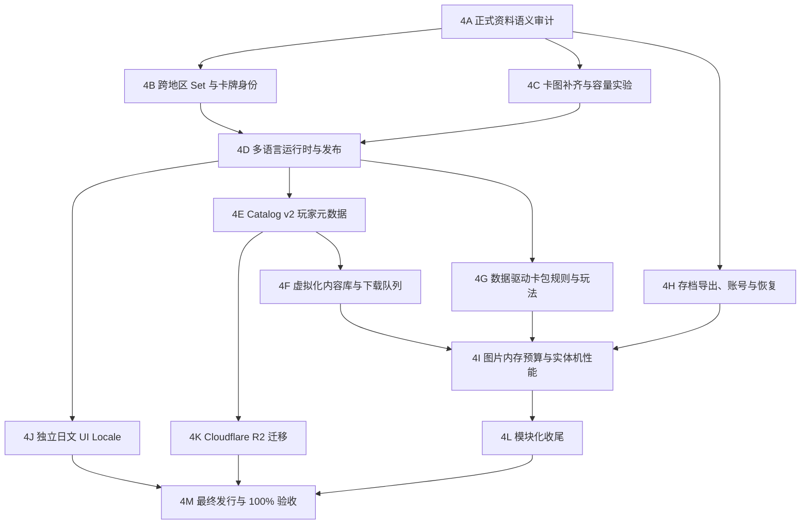

# 第四阶段：资料语义、内容体验、存档恢复与长期运维

状态：4A–4G 已完成；下一步为 4H；4K Cloudflare R2 迁移按用户要求暂停（2026-07-31）。

## 一、阶段目标

第四阶段完成第三阶段验收后发现的全部优化项，并把项目从“技术链路可用”推进到“长期私人游玩可靠”：

1. 让真正对应的英文、日文、简中实体卡能够互相切换，而不是只验证测试夹具。
2. 尽可能补齐日文卡图；无法取得的图片必须有明确、可审计的缺失原因。
3. 让 537 个及未来更多内容包可以按卡牌语言、世代、卡包名称、编号、日期和安装状态顺畅管理。
4. 为卡包提供明确的真实规则、来源指导模拟或通用模拟身份，不把猜测冒充史实。
5. 让收藏在卸载、换手机和云端冲突时可以恢复。
6. 降低下载、安装和解码内存成本，并迁移到可观测、可维护的 Cloudflare R2。
7. 在真实 Android 设备上完成帧率、内存、触觉、音频和蜂窝网络体验验证。
8. 完成剩余旧脚本的模块化迁移，并加入独立的日文应用界面。

应用语言与卡片语言继续保持绝对隔离。增加日文应用界面时，只新增 `ja` UI Locale；不得因为玩家安装或查看日文卡而修改应用语言，也不得根据应用语言偷偷切换卡片语言。

## 二、当前真实基线

以下是第四阶段开始时的收据，不使用测试夹具代替正式资料：

| 项目 | 当前值 | 暴露的问题 |
|---|---:|---|
| 正式内容包 | 537 | 下载协议完整，但内容管理页面仍按包建立常驻行 |
| 全量下载 / 安装 | 1,301,893,754 / 1,356,266,175 bytes | 长期托管、下载选择和空间提示需要升级 |
| 最终 ARM64 APK | 52,643,378 bytes | 已足够小，不把继续压 APK 列为高优先级 |
| 来源卡牌 | 英文 23,444；日文 8,159；简中 12,473 | 总计 44,076 份来源记录 |
| 跨语言自动身份 | 14 个卡牌项，全部为 `en + ja`；`zh-cn` 为 0 | 现有 `Set ID + 卡号` 身份无法覆盖跨地区系列 |
| 卡图覆盖 | 英文 21,828/23,444（93.11%） | 缺 1,616 张，来源需逐项说明 |
| 卡图覆盖 | 日文 3,297/8,159（40.41%） | 缺 4,862 张，是当前最大资料缺口 |
| 卡图覆盖 | 简中 12,463/12,473（99.92%） | 仅缺 10 张，但下载包占 684,086,596 bytes |
| 内容管理压力 | 正式 537 包；现有大目录 PlayMode 仅 48 包 | 当前 `ScrollView` 最终常驻全部行和协调器 |
| 卡包规则 | 3 套历史验证、2 套来源指导模拟，其余通用模拟 | 资料库规模远大于真实配列覆盖 |
| 云存档身份 | Unity 匿名登录 | 卸载或换机后不保证恢复同一云端身份 |
| 代码边界 | 64 个模块内 C#、33 个模块外旧 C# | 仍有控制器、Bootstrap、存档和设置旧边界 |

第三阶段的 100% 结论继续有效，其含义是代码、测试、发布、协议和 Android 软件范围完成。第四阶段新增“资料语义覆盖、玩家内容管理、跨设备恢复和长期运维”完成标准，不倒写历史结论。

## 三、不可破坏的边界

- 收藏数量、NEW 状态和开包历史继续按稳定 `printingId` 保存；跨语言分组只负责浏览和跳转，不合并拥有数。
- 不因为名字相同、宝可梦相同或卡图相似就自动认定为同一张卡；不同插画、规则、卡号、版本或地区独占卡保持独立。
- 手机和 APK 对卡牌资源永远只有 `GET/HEAD` 读取能力，不包含发布令牌、R2 密钥、邮箱会话或 Site owner 权限。
- 邮箱只可用于账号身份，权限限于 `openid/email/profile`；不申请 Gmail、Google Drive 或通讯录权限。云存档对玩家自己的存档具有写权限，这与卡牌资源只读权限是两条独立边界。
- 小说项目与游戏使用不同项目 ID、环境、存档键前缀、远端目录和身份声明；任何冲突测试都必须证明两者不会读取彼此资料。
- 现有 revision 4 与本地收藏在新版本完成远端验证前不得删除。远端孤儿对象清理属于破坏性操作，必须先生成 dry-run 清单并再次取得用户授权。
- 一次只运行一个 Unity Editor 和一个 Android 模拟器/设备目标。普通 UI 与逻辑优先使用 PlayMode，不为同一源码重复构建 APK。
- 每个玩家交互都必须包含本地化文案、动画或稳定状态反馈、点击/完成/失败音效、减少动态效果支持和失败恢复路径。

## 四、目标架构



## 五、实施切片

| 切片 | 主要交付 | 验收重点 | 状态 |
|---|---|---|---|
| 4A 正式资料语义审计 | 可重复的覆盖率、重复、候选与缺失报告 | 正式 44,076 记录；报告 Hash 稳定；不写源资料 | 已完成（2026-07-31） |
| 4B 跨语言身份系统 | Set 等价表、卡牌指纹、置信度和人工复核清单 | 高置信自动合并；歧义不合并；三种语言组合统计 | 已完成（2026-07-31） |
| 4C 卡图补齐与容量优化 | 日文/英文缺图来源层；简中 WebP 质量实验 | Hash、来源、失败清单；视觉与容量对比；可回滚 | 已完成（2026-07-31） |
| 4D 运行时整合与重发 | 正式跨语言组进入 Catalog，详情和图鉴真实可切换 | 正式资料抽样；单语言隐藏；收藏数量不合并 | 已完成（2026-07-31） |
| 4E Catalog v2 玩家元数据 | 通用 package kind、语言、名称、日期、世代、排序和依赖 | schema 安全解析；538 包迁移；安装收据身份稳定 | 已完成（2026-07-31） |
| 4F 内容库与下载队列 | 虚拟化列表、筛选排序、批量选择、有限并发和网络策略 | 2,000 包压力测试；538 包正式 Catalog；暂停/恢复/空间不足 | 已完成（2026-07-31） |
| 4G 规则与玩法深化 | 数据驱动配列、证据标签、批量开包、历史与统计 | 所有产品显式分类；事务保存；动画/音效完整 | 已完成（2026-07-31） |
| 4H 存档恢复 | 本地导出/导入、身份绑定、冲突预览与回滚 | 换机/卸载演练；错误文件拒绝；小说资料隔离 | 待开始 |
| 4I 内存与实体机 | 字节级图片缓存、低内存处理、Profiler 指标和真机体验 | 中端 Android 长时运行；触觉/音频/蜂窝证据 | 待开始 |
| 4J 日文应用界面 | 独立 `ja` UI Locale 与字体覆盖 | `ui=ja/content=en|ja|zh-cn` 全组合隔离 | 待开始 |
| 4K R2 迁移 | 私人 bucket、公开只读域名、对象复制和回滚 | 全包 HEAD/Range/Hash；8/8 写入拒绝；无密钥泄漏 | 用户暂停，本轮不做 |
| 4L 模块化收尾 | 旧控制器、Bootstrap、存档和设置迁入 asmdef | 依赖方向、场景 GUID、存档迁移和 Missing Script | 待开始 |
| 4M 最终验收 | 新 Catalog、最终 ARM64 APK、自动化与设备收据 | 新定义下 `PROJECT COMPLETION VERIFIED: 100%` | 待开始 |

## 六、4A–4D：资料语义与跨语言卡牌

### 6.1 正式审计器

新增只读审计工具，直接读取三语言 manifest 并输出版本化 JSON/Markdown：

- 每语言 Set、卡牌、Printing、卡图和缺图数量。
- 同 Set ID/卡号命中、显式 Set 映射命中、来源身份命中和感知特征候选数量。
- `en↔ja`、`en↔zh-cn`、`ja↔zh-cn` 与三语言组数量。
- 一对多、多对一、同语言重复、不同插画、不同规则、不同稀有度和低置信候选。
- 未匹配不等于失败。4A 先把每条来源记录完整归入“直接候选”或“未匹配”基线；4B 加入 Set 等价证据、指纹和人工 override 后，再将全部记录收敛为“已匹配、语言独占、缺少对应资料、待复核或明确拒绝”。

审计输出不得使用生成时间参与稳定 Hash。相同输入连续运行两次必须得到相同身份结果与 package identity Hash。

#### 4A 完成记录（2026-07-31）

- 新增只读生产审计器、Unity 菜单/批处理入口与 3 项定向 EditMode 测试；输入清单、卡牌资料和图片均不被修改。
- 正式扫描 `en/ja/zh-cn` 共 524 个 Set、44,076 张来源卡牌；37,588 张图片可用、6,488 张未引用图片，图片总量 1,095,274,148 bytes，结构性失败 0。
- 语言覆盖为：英文 21,828/23,444，日文 3,297/8,159，简中 12,463/12,473；与阶段开始时盘点一致。
- 输出 518 个“直接比对候选组”，覆盖 742 张不同来源卡牌：`Set ID + 卡号` 候选 371 组，`来源 + 来源卡 ID` 候选 147 组。候选只用于 4B 复核，不等同已确认合并；其余 43,334 张均被明确归类为未匹配。
- 两次独立生产运行得到相同快照 SHA-256 `183195b01a22c8e36198834aa6fa39fbd4bddf036380168647c5d965c6e520ef`；JSON 文件 SHA-256 均为 `89EC33040EF49B37C7E56DDEA7577E69CE2880F3F25F5B3A1210EFC3FCE31C59`，Markdown 文件 SHA-256 均为 `C5270B6769976BE91083BC82284BD9B0B71527DFFB372CF33217D0695DD9EBF9`。
- 报告写入 `LocalContent/Inventory/multilingual-production-coverage.json|md`，两份产物保持本机忽略，不进入 APK、内容包或 Git。
- 定向审计测试 3/3、完整 EditMode 347/347 通过；4A 只增加 Editor 工具和测试，不改变玩家运行时，因此本切片不重复构建 APK 或运行 PlayMode。

### 6.2 跨地区 Set 等价表

建立版本控制的通用映射，而不是把宝可梦编号写进领域核心：

```text
CrossRegionSetGroup
  groupId
  members[]
    languageId
    sourceSetId
    releaseDate
  relationship
  evidence[]
  reviewStatus
```

允许一对一、一对多与“部分共享卡表”，但不把整套卡强行等同。映射必须记录证据来源、核验日期和人工决定。

### 6.3 卡牌匹配信号

匹配按可靠度分层：

1. 来源提供的稳定跨语言 ID 或已复核人工 override。
2. 已映射 Set + 卡号 + variant + 插画家/卡图身份。
3. 宝可梦主体/形态、卡牌类别、规则字段、HP、招式、插画家和感知 Hash 的多信号组合。
4. 只有名称或同一宝可梦主体时绝不自动合并。

只有多个独立强信号一致时才自动接受。中置信候选进入人工复核清单；低置信或矛盾候选保持单语言。人工决定保存在版本控制 override，不直接修改下载的原始 manifest。

#### 4B 完成记录（2026-07-31）

- 新增版本化 `cross-region-set-mappings.json` 与 `multilingual-card-identity-overrides.json`。两者绑定 4A 覆盖快照，schema、关系、证据、复核日期、重复成员、同语言接受和过期快照均采用失败关闭；当前文件刻意保持空决定，不把自动结果伪装成人工复核。
- 新增确定性身份编译器：每张来源卡生成不含语言名称的语义指纹；来源 ID、Set/卡号、图片 Hash、已复核 Set 映射作为独立信号。只有稳定来源 ID 与另一项强信号同时一致时才自动接受；仅名称、宝可梦主体或单一 Set/卡号绝不自动合并。
- 正式 44,076 张卡得到 371 个唯一候选组：147 个 `en+ja` 双强信号组自动接受，覆盖 294 张卡；224 个 `en+zh-cn` 单信号组保持待复核，覆盖 448 张卡；43,334 张明确保持未匹配，失败 0。没有 `ja+zh-cn` 或三语言组被无证据制造。
- 精简人工复核队列共 224 组、297,036 bytes；抽样可见英文 `Pikachu` 与简中 `班基拉斯` 等仅因 Promo 卡号相同而碰撞，证明单信号拒绝自动合并的边界生效。
- 两次生产编译得到同一身份快照 SHA-256 `8fd886f0b8caa77f17c9e4c57a9a73b2b0494cc2b5b6b2aa8ea97bd3b04c10d7`。全量 JSON、Markdown 与复核队列文件 SHA-256 分别稳定为 `B57EE857C7CD15A2367C74EAE65F7B3F22EBD57DCB2B87B97F67E3F5EBEEB72D`、`54F5AA4855292E888C2BFFCF6FC234FD5B2108AA8DA4596D5CAEEB2247F82EC6`、`78E562E367E726BA1AE151D456BB53AC9B16E01151CE682F019B4E87F6CC2C45`。
- 定向身份测试 5/5、完整 EditMode 352/352 通过，其中明确验证已复核 `equivalent` 只能作为第二项强证据、`unrelated` 必须压过自动信号。输出位于本机忽略的 `LocalContent/Inventory/multilingual-card-identities.json|md` 与 `multilingual-card-review-queue.json`；4D 才把已接受组接入运行时 Catalog，因此本切片不构建 APK 或重复运行玩家 PlayMode。

### 6.4 运行时与玩家体验

- `PrivateManifestCatalogAdapter` 必须加载显式 `PrintingLanguageGroupDefinition`，不再只依赖 `Set ID + 卡号` 自动键。
- 切换时同步更换卡图、卡名、所属地区 Set、卡号、稀有度、variant、来源和拥有数。
- 语言标签出现/消失使用 100–150 ms 淡入；切换继续使用翻卡音效，减少动态效果时即时更新。
- 图鉴相关卡与收藏详情使用同一语言组索引，不各自实现匹配逻辑。
- 保存仍按原 Printing；关闭详情后以全局卡片语言优先，不改变应用语言。

完成条件不是“所有卡都被合并”，而是所有正式记录均有可审计分类，自动接受抽样的错误合并为 0，全部人工 override 可重放且 Hash 稳定。

#### 4D1 正式身份运行时整合记录（2026-07-31）

- 新增严格的 `printing-language-groups.json` 运行时覆盖格式与 reader，绑定 4A 覆盖快照和 4B 身份快照；重复 Group、重复来源卡、同语言重复、非法置信度、未知方法/状态和非 64 位 Hash 均失败关闭。覆盖文件缺席时安全退化为全部单语言，不再用 `Set ID + 卡号` 猜测。
- Editor 编译器把 4B 正式报告投影为只含已接受结果的精简玩家文件；待复核与已拒绝组不会进入运行时。两次正式生成均为 147 组、294 个成员、84,777 bytes，SHA-256 均为 `3568e20cdf3d202867c2739c1ded291911c1d67c72d5f1a4ee8adbef066cedce`。
- `PrivateManifestCatalogAdapter` 将所有 44,076 张来源卡保留为独立 Item，防止英文与简中仅因同 Set/卡号碰撞而共享身份；147 个已接受组通过显式 `PrintingLanguageGroupDefinition` 连接。地区间 variant 标签不一致时，每组先确定性选择一个主要版本连接，并让卡图、卡名、地区 Set、卡号、稀有度和 variant 随 Printing 一起切换；剩余无法一一对应的版本保持单语言。
- 正式本机 Catalog 验证为 147/147 来源组均生成运行时语言组，44,076 个来源 Item、53,480 个正式规则 Printing；错误的英文/简中同号候选仍为两个单语言项。图鉴 Card→Subject 生成器同步使用 `语言 + Set + 来源卡 ID + 卡号` 唯一键，不再回退到旧碰撞键。
- 收藏详情继续按稳定 Printing ID 读取拥有数；语言切换不修改全局卡片语言或应用语言。语言按钮与卡图使用 120 ms 淡入，减少动态效果时即时更新，切换继续播放翻卡音效；只有一个已安装语言时不显示切换器。
- 定向运行时测试 4/4、正式 Catalog 3/3、图鉴关联 3/3、收藏 PlayMode 2/2、完整 EditMode 363/363、完整 PlayMode 10/10 通过。

#### 4D2 本地内容寻址重发记录（2026-07-31）

- 三语言 Card→Subject 快照已用新 Item 唯一键重新生成并独立重建审计：英文 23,444 卡/32,426 Printing，日文 8,159/8,581，简中 12,473/12,473，三者失败均为 0；快照 SHA-256 分别为 `07BFA4ED92ABB9B7EE631D5EE54F579917D6E5828A59183308628DCEDF8BF6D6`、`67A15BCAB896A304D3E299F87AF54FC95B9BFC25162F1039ACDC1362D758B5F1`、`3B46E7C9096853F9CD6C9A8EC53A1A04C85CA999412C83A7E17837237C83C123`。
- 新增 `pokemon.printing-language-groups` 包，只包含 84,777 bytes 的严格覆盖文件；ZIP 为 4,621 bytes，SHA-256 `32bb86fcca3b90dd12e59a2e59fc001895a3a09ccc1b52aab295d39d8700120c`。手机安装路径固定为 `runtime/printing-language-groups`，卡牌 reader 仍只扫描 `<language>/<set>/manifest.json`，不会把覆盖文件误认成卡包。
- 本地 Catalog 从 revision 4/537 包升级为 revision 5/538 包。534 个旧 descriptor 逐字段不变；3 个 Card→Subject 包升级至 revision 5/version 4.1.0；仅新增 1 个覆盖包。升级实际需下载的 4 个包合计 1,265,341 bytes，Catalog 全量下载总和只净增 107,486 bytes，不要求手机重下 1.2 GiB 卡图。
- 发布器连续构建两次得到同一 Catalog 与 package identity；revision 5 Catalog SHA-256 为 `5e03070e29a28e91cf583c49f43f514802a4929c956bda47686816db2886a180`，package identity SHA-256 为 `26a368a8d769f598084049b06989e52d0615ec81b41625cc914d85904b8ef01c`。总下载/安装为 1,302,001,240 / 1,356,924,628 bytes，最大单包 27,914,532 bytes。
- 538/538 包已在临时内容根目录逐包规划、安装、登记并回读：499 个逻辑 Set、44,076 Item、53,480 Printing、147 语言组、1,025 物种、1,579 形态、44,076 Card→Subject 和 1,571 张图鉴图，失败 0。发布定义测试 4/4、最终完整 EditMode 363/363 通过；玩家 PlayMode 10/10 结果继续有效。
- revision 4 Catalog 已另存为 `catalog.revision-4.json`，SHA-256 `4E01BB463C0C9B6952BB40D6417257DA2C095E096932756F1918E6AD33EC9D89`；其 537 个归档全部仍存在且大小一致，3 个旧关联包 Hash 复核也为 0 差异。4D 全程没有上传 Site/R2、没有删除旧远端对象，也没有构建 APK；实体发行与 APK 留给 4M。

## 七、4C：卡图完整性与容量

### 7.1 日文与英文缺图

- 为缺少图片的记录建立来源优先级和可恢复下载 checkpoint。
- 新来源必须固定 HTTPS host、保存来源 URL、取得时间、bytes 和 SHA-256；不能把 API Key 放进手机或 Git。
- 日文当前 4,862 张、英文当前 1,616 张、简中当前 10 张逐项分类。
- 找不到合法可用图片时保留明确的 `source-unavailable` 状态和统一占位图，不抓错语言卡图冒充。
- 导入完成后重新运行解码、尺寸、Hash、孤儿文件和 manifest 引用审计。

#### 4C1 缺图来源复查记录（2026-07-31）

- TCGdex 官方说明只有图片已经被贡献并处理后，Card 才会出现 `image` 字段；缺少该字段代表图片尚未加入资料库。图片 URL 的 `low/high + webp/png/jpg` 规则也只适用于已经返回的图片基址，不能凭卡号自行猜测。
- 新增只读来源审计器：TCGdex 按语言/Set 聚合请求，直链只接受明确 allowlist 中的 HTTPS host；网络失败、非 200、非图片响应、越界 host 和预期数量漂移均失败关闭。只有确认可用的 URL 才进入独立下载队列，原 manifest 与卡图不被修改。
- 正式复查执行 119 个请求：英文 1,616/1,616、日文 4,862/4,862 在当前 TCGdex Set 响应中仍无 `image` 字段；简中 10/10 个既有 `tcg.mik.moe` URL 均为 404。可下载数量为 0、探测失败为 0，因此没有使用其他语言卡图冒充，也没有无意义下载。
- 两次独立远端复查得到相同稳定快照 SHA-256 `b9a0e92cea60643f62c6a9d24ac1890d396be480b912cc4001769b99a3b16cf8`；观察时间保留在收据但不参与稳定 Hash。空下载队列文件 SHA-256 均为 `B869CC870616E553A33557BC992A50B030DCE6B49E568333EC2FDD577851B078`。
- 定向来源测试 4/4、完整 EditMode 356/356 通过。报告和队列位于本机忽略的 `LocalContent/Inventory/missing-card-image-sources.json|md` 与 `missing-card-image-download-queue.json`；未来来源新增图片时可复跑生成安全队列。

### 7.2 简中容量实验

简中 12,463 张 WebP 当前约 681.5 MB 源图片，发行包下载 684,086,596 bytes。对按世代、颜色、文字密度和稀有卡分层抽样的至少 100 张图片测试 WebP 95/90/85：

- 比较文件大小、解码成功率、实际手机显示尺寸和放大详情的文字/边缘质量。
- 自动图像指标只作筛选，最终质量由并排截图和真实手机抽样确认。
- 只有在视觉门槛通过、总容量确有收益时才替换；否则保留 95，不为了数字破坏卡图。
- 新图片采用新内容 Hash 和 revision，不覆盖已发布不可变对象。

#### 4C2 简中 WebP 容量实验记录（2026-07-31）

- 新增只读、确定性的分层抽样工具，正式扫描 12,463 张简中 WebP（681,504,080 bytes），按世代、卡牌类别、稀有度和文件大小分层抽取 120 张，并输出 12 组 `source/Q95/Q90/Q85` 并排复核文件。工具只写入 Git 忽略的 `LocalContent/Inventory`，不会修改 manifest、来源卡图、发行包或远端对象。
- 首次生产实验暴露了 Unity raw texture 与 WebP 文件行方向不同的问题；工具已在编码输入边界显式翻转行，并以 `PSNR > 20 dB` 和平均 RGB 误差门槛防止方向回归。修正前的异常数据不作为容量决策证据。
- 修正后 120 张样本共 5,733,386 bytes：Q95 为 5,556,658 bytes（节省 3.08%，平均/最低 PSNR 41.91/32.09 dB）；Q90 为 4,410,588 bytes（节省 23.07%，平均/最低 PSNR 38.64/31.39 dB）；Q85 为 3,426,172 bytes（节省 40.24%，平均/最低 PSNR 36.82/30.69 dB）。按全量比例估算，Q90 可节省约 157,235,573 bytes，Q85 可节省约 274,249,066 bytes；这是抽样估算，不冒充全量重建结果。
- 普通卡与高纹理样本的原图/Q90/Q85 已并排抽查，文件方向一致，在当前桌面显示尺寸未发现明显差异。但来源本身已经是有损 WebP，继续编码属于二次有损；本轮没有实体手机放大详情证据，因此依照预设门槛保留原始文件，不批量改写 12,463 张卡图，也不生成或发布新 revision。
- 两次正式运行均为 0 失败，稳定快照 SHA-256 均为 `c4ff57a3f56e6fd42ba458b1f2e072ae137c8ff5dfea1f18442723e26076ce3f`，Markdown SHA-256 均为 `C4AC76409CC1DAB8F04C5DD7898BFF09B136BB3E9015693B3033B3704CC63CDF`；48 个复核文件的聚合 SHA-256 均为 `44F678E8105ACA7F3C4036782D1226E3410172ABC9A944CE7F28DF9726FD8972`。
- 定向实验测试 3/3、完整 EditMode 359/359 通过，覆盖来源不破坏、抽样/快照稳定、行方向与画质门槛、视觉副本和 manifest 字节不匹配失败关闭。4C 到此完成；未来若取得无损来源或连接实体手机，可复用同一报告基线评估新 revision，不回写现有不可变包。

### 7.3 运行时图片预算

- `CardTextureCache` 从单一“张数上限”升级为“张数 + 估算解码 bytes”双门槛。
- 当前低清卡约 0.31–0.48 MiB/张作为基线；未来高清资源不得绕过字节预算。
- 响应 Android low-memory，取消无消费者请求并释放 LRU；不得销毁仍在显示的纹理。
- 对损坏、超尺寸、解码失败和快速滚动取消建立回归测试。

## 八、4E–4F：玩家内容库与下载体验

### 8.1 通用 Catalog v2 元数据

Catalog 继续保持通用抽卡系统，不写死宝可梦字段。每个包新增可选玩家元数据：

```text
kind
gameId
contentLanguageId
localizedNames
setId / setCode
releaseDate
generationOrder
sortOrdinal
tags[]
dependencies[]
```

旧安装收据仍以 package ID、revision、version、bytes 和 SHA-256 判断，不因为显示名称改变而重下资源。若直接升级 schema 比兼容层更清楚，可退役 v1 reader，但必须保留 revision 4 安装收据迁移测试和失败回滚。

#### 4E1 基础契约记录（2026-07-31）

- Catalog reader 继续安全读取 schema v1，并严格读取 schema v2；v2 每包必须具有通用 metadata，未知 schema、非法日期、缺失依赖、自依赖和依赖环均在规划下载前失败关闭。
- metadata 只承载玩家可见分类与排序，不进入 `ContentPackageDescriptor` 或安装收据身份；显示名称、标签和依赖变化不会改变现有 ZIP Hash，也不会要求玩家重下卡图。
- 确定性发布器已经输出 schema v2；来源绑定的本机 Catalog 缓存同步保存完整 metadata，已覆盖“在线读取、原子落盘、离线重启”的真实回归路径。
- 验证证据：Catalog 契约 13/13、确定性发布器 8/8、缓存 7/7、完整 EditMode 366/366、完整 PlayMode 10/10 全部通过。当前正式本地 Catalog 仍保持 revision 5/schema v1，不在本切片重写 1.3 GB 内容；下一步为 538 包生成真实分类 metadata，并发布不改变包描述符和收据身份的 revision 6/schema v2 本地 Catalog。

#### 4E2 正式 metadata 与 revision 6 记录（2026-07-31）

- 538 个正式包全部具有非 legacy metadata：524 个 `card-set`、3 个 `card-subject-links`、9 个 `pokedex-artwork`、1 个 `pokedex-taxonomy`、1 个 `printing-language-groups`。524 个 Set 的名称、编号、卡牌语言、世代与世代内 ordinal 全部齐全；421 个具有来源发行日期，另 103 个来源确实为空并保持“未知”，没有虚构日期。
- 12 条显式依赖只把 3 个卡牌图鉴索引与 9 个世代图片包连接到 taxonomy。通用 Catalog/Application 契约不含宝可梦专属字段；`pokemon-tcg`、分类和标签只作为本资料集的 metadata 值。
- 本地正式 Catalog 已迁移为 revision 6/schema v2：504,816 bytes，SHA-256 `643c2fa8209745222738401244e410a528e5cb7210657d80d45d5e834bd8ca2b`。相较 revision 5 只增加 295,055 bytes 的 Catalog JSON；538 个 package descriptor、ZIP 路径、版本、大小与 SHA-256 全部零变化，package identity SHA-256 仍为 `26a368a8d769f598084049b06989e52d0615ec81b41625cc914d85904b8ef01c`，因此现有手机收据不会触发 1.3 GB 重下。
- metadata-only 发布路径会逐一检查 538 个既有 ZIP 的下载 bytes、ZIP 中心目录安装 bytes 与 SHA-256，再原子写入小 Catalog，不重复压缩或解压不可变资源。revision 5 Catalog 与运行时审计分别备份为 `catalog.revision-5.json` 和 `complete-release-audit.revision-5.json`；旧 Catalog SHA-256 仍为 `5e03070e29a28e91cf583c49f43f514802a4929c956bda47686816db2886a180`。
- 正式审计为 538/538 archive 验证、538/538 descriptor 不变、0 更新、0 新包、0 失败；复用上一轮相同 package identity 的 538 个安装收据与 44,076 卡/53,480 Printing/147 跨语言组/1,025 物种/1,579 形态/44,076 关联/1,571 图片运行时审计。最终定向迁移测试 13/13、完整 EditMode 367/367、完整 PlayMode 10/10 通过。本轮只写本机忽略的发行目录，没有上传 Site/R2、没有删除远端对象，也没有构建 APK。

### 8.2 虚拟化内容库

- 使用固定高度 `ListView` 复用可见行，禁止常驻 537/2,000 个完整操作行。
- 下载协调器与事件桥按“可见或正在运行”惰性创建，离开页面后正确解除订阅。
- 提供卡片语言、世代、日期、卡包名称、卡包编号、已安装/可更新/未安装筛选。
- 默认排序为：卡片语言 → 世代 → 发行日期 → Set ordinal → 名称 → 稳定 ID。
- 页面显示已选择下载量、预计安装量、手机可用空间和依赖包成本。

#### 4F1 内容库投影记录（2026-07-31）

- Application 层已加入品牌无关的内容库投影与选择摘要：默认按卡牌语言、世代、真实发行日期、ordinal、玩家显示名称和稳定 package ID 排序；支持名称/编号搜索、卡牌语言、世代、kind 与安装/未安装/可更新状态组合筛选。
- UI Locale 只决定 `localizedNames` 的显示回退，不改变 `contentLanguageId` 筛选；应用语言与卡牌语言继续独立。
- 批量选择会递归展开 Catalog v2 依赖且去重；下载/安装 bytes 只统计尚未处于当前版本的包，并单独报告玩家选择数与额外依赖数。
- 定向 EditMode 5/5、完整 EditMode 372/372 通过；合成 2,000 包两次投影顺序稳定并处于 2 秒安全门槛内。下一切片把现有常驻 `ScrollView` 替换为复用可见行的 `ListView`，并把筛选与容量摘要接入页面。

#### 4F2 虚拟化页面与筛选记录（2026-07-31）

- 内容页面已从常驻所有行/协调器的 `ScrollView` 改为固定 160 px 行高的 `ListView`；`makeItem/bindItem/unbindItem` 回收可见行，安装协调器只在行可见或任务处于下载、安装、暂停、失败状态时保留。
- 页面已接入名称/Set 编号搜索、卡牌语言、世代和安装状态筛选；卡包行显示玩家语言名称、Set Code、世代、真实/未知日期、版本和下载大小。新增筛选文本均进入英文/简中文本表，UI Locale 只更新显示，不改变卡牌语言筛选。
- 合成 2,000 包内容场景实测只创建 1–24 个可见行与协调器，搜索可立即缩到 1 个结果；旧的下载、暂停、继续、失败重试、卸载确认、重装、减少动态效果、点击/完成/失败音效和中英切换路径保持通过。
- 定向展示 EditMode 19/19、内容场景 PlayMode 2/2、完整 EditMode 373/373、完整 PlayMode 10/10 通过。本切片没有构建 APK、没有写 Site/R2；下一步为批量选择、依赖容量摘要和有限并发下载队列。

### 8.3 下载队列

- 支持单包、所选、整世代、整语言和全部安装，但默认不自动下载 1.263 GiB。
- 同时传输上限默认 2，可在设置中调为 1–3；安装/解压限制为 1，避免 I/O 和内存争抢。
- Android 默认提供“仅 Wi-Fi 下载大型资源”；蜂窝开始前显示大小确认。网络切换不丢 `.part`。
- 队列支持暂停、恢复、取消、失败重试、应用重启恢复和逐包原子安装。
- 单包完成使用现有下载完成音效和轻震；批次只在总体完成时额外播放一次，失败不得连续轰炸。
- 批量删除先显示影响范围，继续保留收藏；删除和远端孤儿清理不能共用危险入口。

#### 4F3 有限并发队列核心记录（2026-07-31）

- Application 层已加入品牌无关的安装队列：选择会自动展开并去重 Catalog v2 依赖，依赖包成功后才允许启动下游；协调器仅在任务真正开始时创建。
- 并行下载默认 2，配置范围严格限制为 1–3；HTTP 工厂中的全部协调器共享单一安装 `SemaphoreSlim`，因此两个下载可并行，但 ZIP 校验、解压和原子提交始终只有 1 个。
- 队列支持整批暂停、继续、取消和“只重试失败项”；暂停保留现有 `.part` 语义，失败依赖会阻止并明确失败下游，不会悄悄安装不完整组合。
- 定向队列 EditMode 6/6、完整 EditMode 379/379、完整 PlayMode 10/10 通过，实测下载并发峰值 2、安装峰值 1。下一切片把选择、依赖容量摘要和队列控制接入虚拟化页面；重启持久化、Wi-Fi/蜂窝策略与空间确认随后补齐。

#### 4F4 批量选择、容量摘要与队列页面记录（2026-07-31）

- 虚拟化页面已接入“选择当前结果、清空选择、下载所选”与队列暂停、继续、失败重试、取消；每个可见卡包行带独立选择框，筛选变化不会把应用语言与卡牌语言混在一起。
- 选择摘要会递归计算额外依赖、尚需下载 bytes 与预计安装 bytes；队列摘要同步显示排队、进行中、完成和失败数量。中英文本已进入 String Table，所有批量操作继续使用稳定 `VisualElement + Label` 控件、统一点击/开始/完成/失败音效和减少动态效果边界。
- 合成 2,000 包全选实测得到 200,000 bytes 下载与 400,000 bytes 安装预估，同时仍只创建 1–24 个可见行协调器；不会因为批量选择实例化 2,000 个离屏下载对象。两包 PlayMode 批量下载后，安装登记与容量摘要均归零。
- 队列补强了依赖失败时的最终快照通知，确保下游被阻止后页面仍能进入可重试终态；已完成的批次可创建新队列再次安装，不会被旧成功项吞掉。
- 定向 EditMode 26/26、内容场景 PlayMode 3/3、完整 EditMode 380/380、完整 PlayMode 11/11 全部通过。本切片没有构建 APK，没有上传或配置 Site/R2，也没有触碰远端对象。4F 下一步是队列重启持久化、Wi-Fi/蜂窝策略、真实可用空间展示与开始前空间确认。

#### 4F5a 网络与空间预检核心记录（2026-07-31）

- Application 层新增品牌无关的整批下载预检服务；开始前以“所有待下载 ZIP + 所有待安装内容 + 单一 32 MiB 回滚保留量”计算保守空间门槛，并通过既有 Android `StatFs`/桌面磁盘探针读取内容卷真实可用空间。
- 网络被稳定分类为离线、Wi-Fi/有线、蜂窝与未知；离线、未知网络、空间不足和存储读取异常全部 fail-closed。大型下载门槛默认 100 MiB，默认开启“大型资源仅 Wi-Fi”；关闭该偏好后，任何蜂窝下载仍必须取得单次明确确认。
- Unity 网络状态与 PlayerPrefs 偏好实现位于 Infrastructure，Application 不依赖 Unity API；服务已接入 `ApplicationServices` 与 Bootstrap，偏好键为 `settings.downloads.wifi-only-large`，读取失败时安全回退为仅 Wi-Fi。
- 定向 EditMode 14/14、完整 EditMode 387/387、完整 PlayMode 11/11 通过。本切片没有构建 APK、没有触碰 Site/R2；下一切片把预检状态、真实空间和 Wi-Fi 偏好接入内容页面，并在网络降级时保留 `.part` 后暂停队列。

#### 4F5b 网络/空间页面与安全降级记录（2026-07-31）

- 内容页面会在玩家选包后显示真实可用空间、保守所需空间与当前网络类型；100 MB 以上仅 Wi-Fi 的偏好可直接切换并持久化。空间不足、离线、未知网络或存储读取失败时，批量与单包下载都不会启动。
- 蜂窝下载使用明确的两步确认：第一次操作显示本批下载大小并把主操作改为“确认使用移动数据下载”，第二次才开始或恢复；关闭“大型资源仅 Wi-Fi”不会绕过这次单批确认。
- 下载期间从 Wi-Fi 降级为蜂窝、离线或未知网络时，页面会调用既有暂停路径保留 `.part`，不会删除断点；回到安全网络可继续，蜂窝则必须完成上述确认。单包协调器与整批队列共用同一策略，但应用语言与卡牌语言状态不受网络偏好影响。
- 新增预检、网络与 Wi-Fi 偏好中英文本；批量按钮继续保持稳定 `VisualElement + Label` 渲染节点，确认、暂停、完成和错误反馈沿用统一音效/动画与减少动态效果设置。
- 定向 EditMode 26/26、内容场景 PlayMode 3/3、完整 EditMode 387/387、完整 PlayMode 11/11 全部通过；PlayMode 实际覆盖“Wi-Fi 下载中 → 蜂窝自动暂停 → 关闭仅 Wi-Fi → 第一次确认 → 第二次断点续传 → 全部完成”。本切片没有构建 APK，也没有触碰 Site/R2。

#### 4F6 队列重启恢复与 4F 收口记录（2026-07-31）

- 队列以 schema v1 本地状态保存 Catalog revision 与玩家原始选择 package ID；依赖不重复写成玩家选择，恢复时再由当前 Catalog 重新展开、去重和校验。状态不包含卡图、账号、凭证、URL 或任何远端写权限。
- Android/Player 状态文件位于 `persistentDataPath/ContentDownloads/install-queue-v1.json`；Editor 使用对应 `LocalContent/Downloads` 私人目录。Infrastructure 以严格 UTF-8、512 KiB/4,096 ID 上限、临时文件与可恢复 rename transaction 原子写入，并拒绝非法 ID、超大、损坏和文件链接。
- 排队、运行、暂停或失败批次会保留恢复状态；全部成功或玩家明确取消后清理。应用/场景重启把恢复项统一设为“已暂停”，重新选择原始卡包并等待玩家操作，不会自行使用 Wi-Fi/蜂窝；继续时仍重新经过当前 Hash、安装收据、空间与网络策略。
- Catalog revision 变化会重新验证仍存在的 ID；缺失包、损坏文件或未知 schema 只产生玩家可见恢复警告，不阻断 Catalog 和已安装内容。内容场景 PlayMode 已在真实下载暂停后重载场景，验证选择/队列恢复、蜂窝重新确认、断点续传与最终清理。
- 队列/文件/服务/展示定向 EditMode 39/39、内容场景 PlayMode 3/3、完整 EditMode 393/393、完整 PlayMode 11/11 全部通过。正式 revision 6/schema v2 Catalog 为 538 包，合成 2,000 包仍只创建 1–24 个可见行/协调器；4F 至此完成。本轮没有构建 APK，没有上传或配置 Site/R2，也没有删除远端对象。

性能目标：正式 537 包与合成 2,000 包均可在限定帧内进入可交互状态；可见行数量保持与视口规模一致；筛选、滚动和进度更新无持续内存增长。

## 九、4G：真实配列与游戏循环

- 把 Pokémon 规则从少量硬编码 provider 迁移为版本化、可由内容包扩展的数据定义；通用抽卡引擎保持品牌无关。
- 每个可开产品必须显式属于 `HistoricallyVerified`、`SourceInformedSimulation` 或 `UnverifiedSimulation`，不得静默进入未知规则。
- 规则记录地区、语言、发行版本、卡位、保证条件、变体排除、概率、来源、核验日期和置信度。
- 优先按玩家可见世代补齐规则；没有足够证据时继续明确显示“模拟”，不伪造历史配列。
- 新增 1 包/10 包批量开启、可跳过已看动画、开包历史、语言/系列/稀有度统计和概率说明。
- 十连动画应保留首包仪式感，后续采用短过渡；高稀有卡仍有独立揭晓，减少动态效果时改为静态高亮和音效。
- 整个批次使用单次库存事务；任一保存失败不得留下半批收藏。

4G 第一组已于 2026-07-31 完成：品牌无关的 schema v1 `ProductRuleCatalogDefinition`、JSON source、严格编译器与可替换 provider 已建立。原先写死于两个 Pokémon C# provider 的 3 套历史规则和 2 套来源模拟全部迁入 `pokemon-product-rules-v1.json`；运行时仍由通用 `IProductRuleProvider` 返回 Profile，旧 provider 只保留薄兼容门面。每份定义现在显式记录 revision、Set、卡片语言、发行日、地区、可信分类、置信度、来源/核验日、卡池筛选、卡位、概率总权重和排除项，并加入日文规则说明。编译器在进入游戏前验证 schema、Set 发行日、池/槽引用和每个筛选组件的预期卡数，资料漂移会失败关闭。现有 5 套规则的卡位、概率与 Cinderace/Machamp 等例外保持等价；定向 EditMode 17/17、完整 EditMode 395/395、完整 PlayMode 11/11 通过。下一组为 1/10 包原子事务、动画节奏、历史与统计。

4G 第二组已于 2026-07-31 完成：`ProductOpeningService` 的 1 包与 10 包统一进入同一个批次命令，十连先按连续产品序号完成全部抽取，再由库存层单次写盘；保存失败会把卡片数量、NEW、开包计数、历史和统计一起回滚，不留下半批收藏。存档升级为 v4，继续读取 v2/v3，并保存最多 250 个批次历史以及按卡片语言、Set、稀有度聚合的统计。开包页新增“开 1 包/十连开包”、首包完整撕包、后续短揭晓、可随时“全部揭晓”、十连总结、最近历史和统计面板；所有新增操作都有中英文文案、按压/确认或开包/揭晓音效，并遵守减少动态效果。真实 PlayMode 同一路径完成 1 包、第二个系列 1 包与 10 包/110 张批次，验证累计 12 包/132 张、历史 3 条和统计显示；完整 EditMode 397/397、PlayMode 11/11 通过。4G 至此完成。

## 十、4H：存档恢复与身份

先完成不依赖服务器账号的安全恢复，再接账号：

1. 版本化存档 envelope、校验和、来源设备/时间和只读预览。
2. Android Storage Access Framework 导出/导入；导入前自动备份，损坏、降级或其他游戏命名空间文件拒绝写入。
3. 模拟卸载/换机恢复收藏、NEW、开包历史、设置和语言偏好；已下载卡图不进入存档。
4. 再接可恢复身份。邮箱/OIDC 只申请 `openid/email/profile`，并使用独立游戏项目与环境。
5. 云端冲突先显示本地/云端摘要和时间，允许保留本地、采用云端或合并；任何失败都能回滚。

Google Drive 不是必需前置。若未来选择 Drive 自动备份，必须另行安装连接器/实现并取得明确授权，不能因为邮箱登录顺便扩大 Drive 权限。

## 十一、4J：独立日文应用界面

- 增加 `ja` Locale、String Table、Android 应用名和日文字体覆盖。
- 应用语言选项为 `en/zh/ja`；卡片语言继续为 `en/ja/zh-cn`，两个列表分别保存。
- 覆盖所有玩家文本、错误、下载状态、概率证据和图鉴说明；不只翻译主菜单。
- 自动验证九种 `UI × 卡片` 组合，以及无卡牌 Catalog 时应用语言仍可切换。

## 十二、4K：Cloudflare R2 迁移

R2 在内容和 Catalog v2 稳定后执行，避免重复上传大版本：

1. 用户在 Cloudflare 建立私人 bucket、受限 `Object Read & Write` Token 和公开只读自定义域名。
2. 本机预检 537+ 新 revision 包的路径、bytes、SHA-256 和对象键；凭据只在进程环境中。
3. 复用已存在对象，上传缺失不可变 ZIP，逐个验证 origin 与公开 URL，最后发布 catalog。
4. 对新域名执行完整 HEAD、Range、Hash、缓存和匿名写入拒绝审计。
5. 先让测试配置切换并保留 Site 回滚；通过 Android 下载/暂停/恢复/离线缓存后再设为正式配置。
6. Site 旧对象只生成占用与孤儿 dry-run 报告，不自动删除。

缺少 R2 endpoint、bucket、域名或凭据只阻塞 4K，不阻塞 4A–4J 的本机实现。

## 十三、4I 与 4L：真实设备和模块化

### 13.1 实体 Android 验收

- 至少一台目标中端 Android：冷启动、内容库 537 包、收藏滚动、图鉴搜索、语言切换、十连开包和 20 分钟往返。
- 收集 CPU frame time、GC alloc、托管/纹理内存、下载吞吐、温度趋势和 low-memory 恢复。
- 30 FPS 预算下 95% 帧不超过 33.3 ms；暖机后重复场景循环的保留内存增长不超过已定义门槛。
- 实测 Wi-Fi→蜂窝→离线→恢复的断点行为，以及实体震动手感、扬声器音量/削波和后台音频焦点。
- 模拟器只用于布局和自动化，不能替代实体硬件结论。

### 13.2 模块化收尾

- 按调用链逐个迁移 `GachaViewController`、`CollectionViewController`、Bootstrap、Local/Cloud Save 和旧设置代码。
- Domain 不依赖 Unity；Application 不依赖 HTTP、文件系统、R2 或场景；Presentation 不直接调用导入器和远端发布器。
- 先添加新组件并迁移场景引用，再删除无调用旧实现；检查 Scene、Prefab、GUID、序列化字段和存档版本。
- 不以一次大重写完成。每个模块迁移都是独立 Git 切片，并通过编译、引用与场景回归后提交。

## 十四、验证矩阵

每个切片至少执行定向测试；涉及玩家行为时优先 PlayMode。最终验收包括：

- EditMode：身份匹配、歧义拒绝、覆盖审计、图片 Hash/尺寸、Catalog v2、队列、存档迁移、R2 与依赖方向。
- PlayMode：正式规模虚拟列表、筛选排序、下载状态、三种 UI Locale、三种卡片语言、详情切换、十连事务和场景 soak。
- 数据：三语言所有记录分类、缺图原因、人工 override 重放、双构建 Hash、隔离安装回读和旧收据迁移。
- 远端：全部对象 HEAD/Range/SHA-256、Catalog 最后发布、匿名写入拒绝、配置敏感字段 0。
- Android：纯 ARM64、权限边界、签名、zipalign、私人内容 0 命中、真实设备体验收据。
- 工作区：`git diff --check`、Missing Script、`.meta`/GUID、临时文件、只暂存当前主题；保留用户已有字体、主题、Render Pipeline、ProjectSettings 和 Addressables 修改。

不使用旧的 344/344、10/10 或 revision 4 审计证明第四阶段成功。最终数字必须来自完成全部改动后的新测试运行。

## 十五、Git 检查点

建议提交主题：

1. `test(content): audit multilingual production coverage`
2. `feat(cards): link reviewed multilingual printings`
3. `feat(content): complete and optimize card images`
4. `feat(content): publish multilingual identity groups`
5. `feat(content): add player-facing catalog metadata`
6. `perf(content): virtualize package library`
7. `feat(content): add resumable batch download queue`
8. `feat(gacha): load evidence-backed product rules`
9. `feat(gacha): add bulk opening history and statistics`
10. `feat(save): export and recover player progress`
11. `feat(auth): link recoverable game identity`
12. `feat(i18n): add independent Japanese UI locale`
13. `perf(images): enforce decoded memory budgets`
14. `refactor(modules): retire remaining legacy boundaries`
15. `feat(content): migrate verified release to r2`
16. `docs(phase4): record final acceptance`

每个主题只在对应验证通过后提交，不混入用户原有未提交文件。除非用户明确要求，不 push、不删除远端对象、不创建公开发行。

## 十六、预计节奏

这是一个完整新阶段，不适合一次长 Unity 会话完成。按当前资料量估算：

| 范围 | 预计有效工作时间 | 主要不确定性 |
|---|---:|---|
| 4A–4D 资料语义 | 20–40 小时 | 跨地区资料证据与人工复核量 |
| 4C 卡图补齐/容量 | 10–30 小时机器与人工时间 | 日文替代图片来源、下载速度 |
| 4E–4F 内容体验 | 12–20 小时 | Android UI Toolkit 与网络状态 |
| 4G 规则与玩法 | 20–50 小时 | 历史配列来源数量；可持续增量扩展 |
| 4H/J 存档与日文 UI | 12–24 小时 | 外部身份配置、翻译复核 |
| 4I/L 性能与模块化 | 16–30 小时 | 实体设备表现和旧场景引用 |
| 4K/M R2 与最终验收 | 8–16 小时，另加上传时间 | Cloudflare 参数、1+ GiB 上传 |

总计约 98–210 小时有效工作与机器等待时间。可以连续自主推进本机范围；R2 凭据、外部账号配置、远端删除和实体手机接入属于必须由用户提供或授权的检查点。

## 十七、第四阶段 100% 定义

只有以下条件同时满足才可标记 100%：

- 正式三语言记录全部具有确定分类，跨语言组覆盖报告和人工复核结果可重现。
- 日文/英文/简中缺图全部补齐或明确记录不可取得原因，没有错误语言冒充。
- 537 包及 2,000 包压力目录使用虚拟化内容库，排序、筛选、队列、空间和网络策略均通过。
- 所有可开产品显示明确规则可信度；批量开包、历史和统计保存可靠。
- 本地导出/导入与可恢复账号完成换机演练，小说和游戏资料隔离。
- 图片字节预算、长时场景与真实 Android 硬件验收通过。
- 新 revision 在 R2 或被明确接受的正式托管目标完成完整只读审计，并保留回滚。
- 模块依赖、完整 EditMode/PlayMode、最终 ARM64 APK、隐私边界和完成度审计全部为新鲜证据。

当前下一步为 4H：本地存档导出/导入、身份绑定、冲突预览与回滚。4K R2 迁移保持暂停；除非用户以后明确恢复，不要求 R2 凭据，也不执行上传、远端配置或删除。
